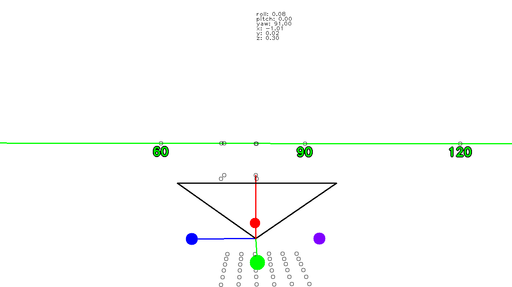

# LiveLens

## What this project really is

This is a project that basically implements a 3D rendering engine from scratch (at least for now). But make no mistake, this isn't just another game engine coded in python. For now is a ember for one of the most sophisticated Live OSD systems. Imagine being able to view a waypoint on a map using OSD overlay. This can have numerous applications starting from aiding navigation ending on interactive racing for drones without the need to crash into a gate.

To **win stupid prizes** you need to **play stupid games**. This game is mine.

## Whats available right now

For once, basic rendering of the world, and I really mean very basic (fps not to scale).

